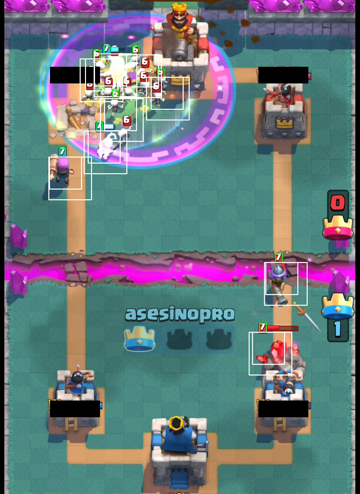

# clash-royale-photo-mosaic

Create photo mosaic images with tiles from Clash Royale units. No tile duplicated (but some tiles are very similar).

## Preview


## Usage

Check main.py. Just run it.
```bash
python3 main.py
```

I added my computed tiles in 48x48 and 64x64 so that you can create your own Clash Royale mosaic images fast. I can't add all the recordings, they are just too big. Just added a sample.

Program exists of 3 components:

### VideoProcessor
Generates single frames out of the recorded videos. I used 100+ videos, each video about ~1 min length (recorded the game in x4 playtime). The VideoProcessor extracted about 6600 frames in ~15 minutes.
```python
    # (skipFramesBeginEnd, stepFrames)
    videoProcessor = VideoProcessor(300, 45)
    videoProcessor.createFrames()
```

### ImageProcessor
Create tiles by template matching. 24 templates are defined in the templates directory. Added multiprocessing, but still takes a huge amount of time. Creating tiles from the 6.600+ frames took me 30+ minutes to get 20.000+ tiles for 48 tile size, another 30+ minutes for the 64 tile size.
```python
    # ([tileSizes])
    imageProcessor = ImageProcessor([48, 64])
    imageProcessor.createTiles()
```

### MosaicProcessor
Generates mosaic image out of the tiles. Generating the example image took me 267 seconds on a Ryzen 2600X (6/12 Cores). Tiles will be computed simultaneously with multiprocessing.
```python
    # (inFile, outFile, tilesDirectory, outFileTilesInXAxis)
    mosaicProcessor = MosaicProcessor('cr.jpg', 'out.jpg', 'tiles48-lexycon', 84)
    mosaicProcessor.createMosaic()
```
## Matching

Using template matching on unit levels. To avoid matching cards with lots of units (skeleton army), same card level icons need to have a distance of >100px to be matched. The health bar of the princess towers sometimes got a match, so i removed them (just for matching obv.). Overall it's not perfect, the level of the card will not be centered anymore, if the unit gets damage. But it's acceptable.




## TODO

* python reaches it's limits for this amount of tiles
* colors are not perfect, no idea if more tiles are neccessary or just the placement algorithm should be improved (probably both)
* template matching could be improved by not checking so much templates (probably remove duplicated templates for each color red/blue)
* mse probably not the best matching algorithm (tried ssim but result was way worse, however)
